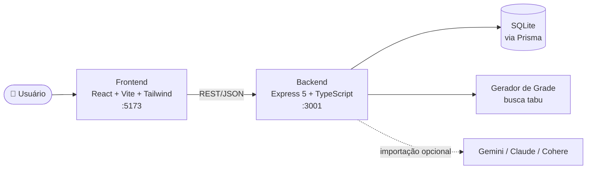

<div align="center">

# 🏫 School Grid Creator

**Monte a grade horária da sua escola em segundos — sem choques de professores, respeitando a disponibilidade de cada um.**


[Funcionalidades](#-funcionalidades) •
[Começando](#-começando) •
[Como usar](#-como-usar-em-5-passos) •
[Documentação](#-documentação) •
[Arquitetura](#-arquitetura)

</div>

---

## ✨ O que é

Montar o horário de uma escola é um quebra-cabeça: cada turma precisa de N aulas de cada matéria, cada professor só pode estar em uma sala por vez, e muitos professores têm dias e horários em que não podem dar aula.

O **School Grid Creator** resolve isso para você. Você cadastra professores, disciplinas, turmas e restrições — ou deixa uma **IA ler uma foto ou texto** e cadastrar tudo — e o sistema gera a grade semanal completa, pronta para imprimir ou exportar para o Excel.

> 💡 Uma escola real com 8 turmas, 17 professores, 30 horários semanais e dezenas de restrições é resolvida **em menos de 10 milissegundos**, sem nenhum conflito.

---

## 🚀 Funcionalidades

| | Funcionalidade | Descrição |
|---|---|---|
| 🧠 | **Gerador inteligente** | Busca tabu orientada a conflitos: zero choques de professor, horários bloqueados respeitados e no máximo 2 aulas da mesma matéria por dia. |
| 🔍 | **Verificador de viabilidade** | Antes de gerar, diz exatamente por que uma grade é impossível (ex.: *"Ana precisa dar 10 aulas, mas só tem 9 horários livres"*). |
| 🗓️ | **Restrições clicáveis** | Marque os horários em que cada professor **não** pode dar aula clicando numa tabela dia × horário. |
| 👀 | **Duas visões da grade** | Veja a grade **por turma** ou **por professor**. |
| 📤 | **Exportação e impressão** | Exporte para CSV (abre direto no Excel, com acentos) ou imprima uma turma/professor por página. |
| 🗂️ | **Histórico** | Salve, renomeie, reabra e exclua grades geradas. |
| 🪄 | **Importação Mágica com IA** | Envie uma foto de tabela ou um texto livre; Gemini, Claude ou Cohere extraem professores, matérias, turmas, cargas e restrições. |
| 🏫 | **Multi-escolas** | Gerencie quantas escolas quiser num só painel. |
| ⚠️ | **Alertas de sobrecarga** | Cartões ficam vermelhos quando um professor ou turma tem mais aulas que horários disponíveis. |
| 🔒 | **Local e privado** | Dados em SQLite na sua máquina. Chaves de IA ficam só no seu navegador. |

---

## ⚡ Começando

### Pré-requisitos

- [Node.js](https://nodejs.org/) **20.19+ ou 22.12+** (testado no Node 24)
- npm (já vem com o Node)

### Instalação

```bash
git clone https://github.com/Autierii/School-Grid-Creator.git
cd School-Grid-Creator
```

**Terminal 1 — Backend**

```bash
cd backend
npm install
npx prisma db push      # cria o banco SQLite (prisma/dev.db)
npm run dev             # 👉 http://localhost:3001
```

**Terminal 2 — Frontend**

```bash
cd frontend
npm install
npm run dev             # 👉 http://localhost:5173
```

Abra **http://localhost:5173** no navegador. Pronto! 🎉

> 🧪 **Quer testar com dados reais?** Rode `npx ts-node create_complex_school.ts` dentro de `backend/` para criar uma escola de exemplo completa (8 turmas, 17 professores, 10 disciplinas, com restrições).

---

## 🧭 Como usar em 5 passos

1. **Crie a escola** na tela inicial.
2. **Cadastre disciplinas** (nome + sigla, ex.: *Matemática / MAT*).
3. **Cadastre professores** e, na aba *Restrições de Horário*, clique nos horários em que cada um não pode dar aula.
4. **Crie as turmas** e atribua a cada uma: professor + disciplina + quantidade de aulas semanais.
5. Em **Gerar Nova Grade**, informe os blocos de aula (ex.: `7h, 7h50, 8h40, 9h50, 10h40`) e clique em **Gerar Solução**. Salve no histórico, exporte ou imprima.

📖 Passo a passo detalhado, com dicas e solução de problemas: **[Guia de Uso](docs/GUIA-DE-USO.md)**.

---

## 📚 Documentação

| Documento | Para quem | Conteúdo |
|---|---|---|
| 📖 [Guia de Uso](docs/GUIA-DE-USO.md) | Coordenação / usuários | Fluxo completo, importação por IA, dicas e problemas comuns |
| 🏗️ [Arquitetura](docs/ARQUITETURA.md) | Desenvolvedores | Visão geral, modelo de dados, fluxo de geração, estrutura de pastas |
| 🧠 [Algoritmo do Gerador](docs/GERADOR.md) | Desenvolvedores / curiosos | Como a grade é calculada, restrições, pesos e desempenho |
| 🔌 [Referência da API](docs/API.md) | Desenvolvedores / integrações | Todos os endpoints REST com exemplos |
| 🛠️ [Desenvolvimento](docs/DESENVOLVIMENTO.md) | Contribuidores | Scripts, variáveis de ambiente, banco de dados, convenções |

---

## 🏗️ Arquitetura



```
School-Grid-Creator/
├── backend/
│   ├── prisma/schema.prisma     # modelo de dados
│   ├── src/
│   │   ├── index.ts             # rotas da API
│   │   ├── generator.ts         # algoritmo de geração da grade
│   │   ├── school-data.ts       # banco → formato do gerador
│   │   ├── ai.ts                # importação mágica com IA
│   │   └── db.ts                # cliente Prisma
│   └── create_complex_school.ts # seed de exemplo
├── frontend/
│   └── src/
│       ├── App.tsx              # rotas, escolas e menu lateral
│       ├── api.ts               # cliente HTTP e tipos compartilhados
│       ├── pages/               # Professores, Disciplinas, Turmas, Gerar, Histórico
│       └── components/          # GradeView, MagicImport, AiConfigModal
└── docs/                        # documentação
```

Detalhes em **[docs/ARQUITETURA.md](docs/ARQUITETURA.md)**.

---

## 🛠️ Stack

| Camada | Tecnologias |
|---|---|
| **Frontend** | React 19, TypeScript, Vite 8, Tailwind CSS 4, React Router 7, Lucide Icons, Oxlint |
| **Backend** | Node.js, Express 5, TypeScript, Prisma 5, SQLite, Multer |
| **IA (opcional)** | `@google/generative-ai`, `@anthropic-ai/sdk`, API REST do Cohere |

---

## ⚙️ Configuração

Tudo funciona sem configuração. Se precisar, use variáveis de ambiente:

| Onde | Variável | Padrão | Para quê |
|---|---|---|---|
| backend | `PORT` | `3001` | Porta da API |
| backend | `GEMINI_MODEL` | `gemini-2.5-flash` | Modelo usado na importação via Gemini |
| backend | `CLAUDE_MODEL` | `claude-opus-5-5` | Modelo usado na importação via Claude |
| backend | `COHERE_MODEL` | `command-a-03-2025` | Modelo usado na importação via Cohere |
| frontend | `VITE_API_URL` | `http://localhost:3001/api` | Endereço da API |

---

## 🗺️ Próximos passos (ideias)

- [ ] Arrastar e soltar aulas na grade gerada para ajustes manuais
- [ ] Aulas geminadas (duas aulas seguidas da mesma matéria)
- [ ] Preferências de horário (além de bloqueios)
- [ ] Turnos e dias da semana configuráveis
- [ ] Exportação em PDF

---

<div align="center">
Feito com ❤️ para quem já perdeu um fim de semana montando horário escolar no Excel.
</div>
