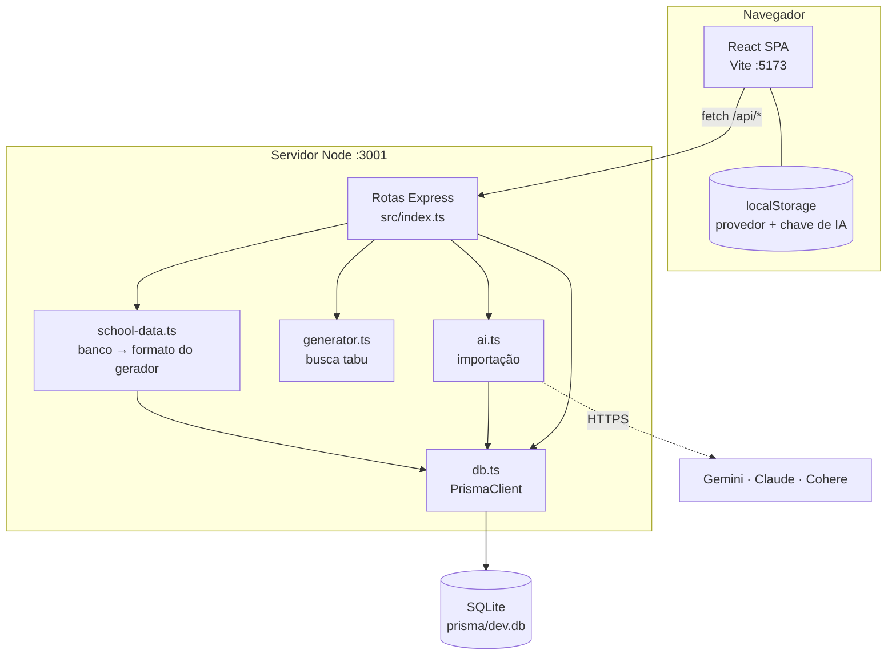
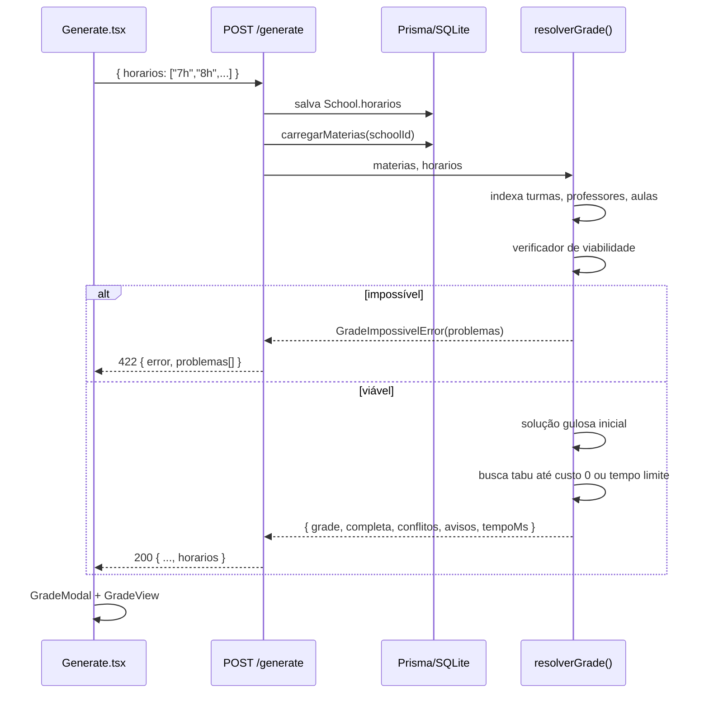
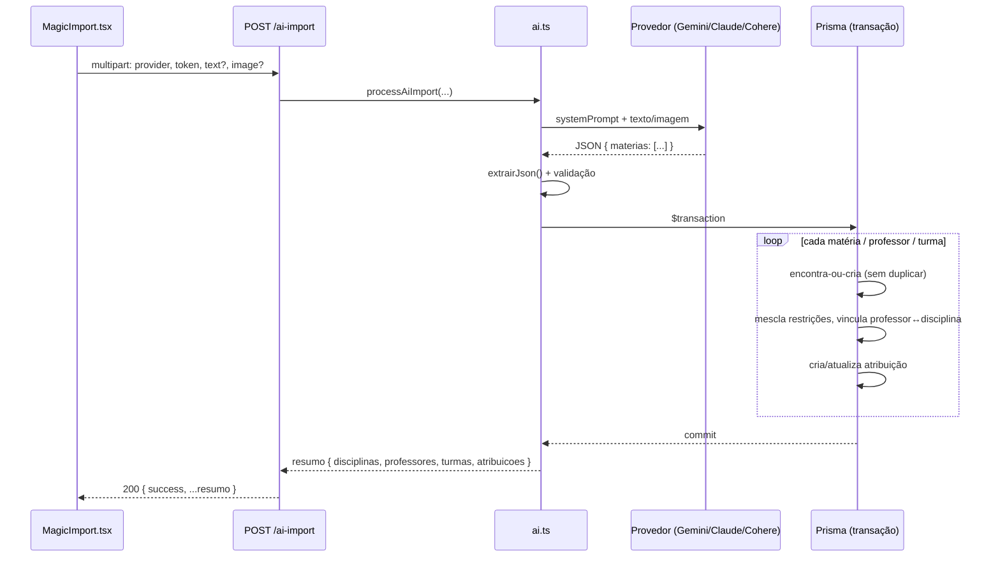

# 🏗️ Arquitetura

Visão técnica de como o School Grid Creator é organizado.

> ⬅️ [Voltar ao README](../README.md)

## Sumário

- [Visão geral](#visão-geral)
- [Backend](#backend)
- [Modelo de dados](#modelo-de-dados)
- [Frontend](#frontend)
- [Fluxo de geração da grade](#fluxo-de-geração-da-grade)
- [Fluxo da importação com IA](#fluxo-da-importação-com-ia)
- [Decisões de projeto](#decisões-de-projeto)

---

## Visão geral

O projeto é um monorepo com duas aplicações independentes que conversam por HTTP/JSON:



| Camada | Responsabilidade |
|---|---|
| **Frontend** | Interface, cadastro, edição das restrições, visualização/exportação/impressão das grades. Não tem lógica de negócio crítica. |
| **Backend** | Persistência, validação, verificação de viabilidade, geração da grade, integração com IA. |
| **Banco** | SQLite local, acessado só pelo Prisma. |

---

## Backend

```
backend/
├── prisma/
│   ├── schema.prisma          # modelo de dados (fonte da verdade)
│   └── dev.db                 # banco SQLite (ignorado no git)
├── src/
│   ├── index.ts               # app Express: rotas, validação, tratamento de erros
│   ├── generator.ts           # resolverGrade(): verificação + busca tabu
│   ├── school-data.ts         # carregarMaterias(), parseRestricoes()
│   ├── ai.ts                  # processAiImport(): chama a IA e grava os dados
│   └── db.ts                  # instância única do PrismaClient
├── create_complex_school.ts   # seed: escola de exemplo + geração
├── save_complex_schedule.js   # salva grade-final.json no histórico
└── test-api.js                # script manual de teste da API
```

### `index.ts`

- Express 5 — erros lançados em handlers `async` vão direto ao middleware de erro.
- `HttpError(status, mensagem)` para erros esperados; o middleware final converte:
  - `HttpError` → status + `{ error }`;
  - Prisma `P2025` (registro inexistente) → `404`;
  - upload acima de 10 MB → `400`;
  - qualquer outro → `500` (logado no console).
- Helpers: `texto()` valida campos obrigatórios; `restricoesJson()` normaliza restrições (aceita array ou string JSON).

### `school-data.ts`

`carregarMaterias(prisma, schoolId)` lê disciplinas → atribuições → professor/turma e monta a estrutura que o gerador espera:

```ts
MateriaReq[] = [{
  id, sigla,
  professores: [{ id, nome, indisponibilidades: [{ dia, hora }], turmas: [{ id, nome, aulas }] }]
}]
```

### `generator.ts`

Função pura (não acessa banco) — veja **[GERADOR.md](GERADOR.md)**.

### `ai.ts`

Monta o prompt, chama o provedor escolhido, extrai o JSON da resposta e grava tudo numa transação. Veja o [fluxo abaixo](#fluxo-da-importação-com-ia).

---

## Modelo de dados

```mermaid
erDiagram
    School ||--o{ Teacher : possui
    School ||--o{ Subject : possui
    School ||--o{ Class : possui
    School ||--o{ Schedule : "histórico"
    Teacher }o--o{ Subject : "leciona (TeacherSubjects)"
    Teacher ||--o{ TeacherClassSubject : "atribui"
    Class ||--o{ TeacherClassSubject : "atribui"
    Subject ||--o{ TeacherClassSubject : "atribui"

    School {
        string id PK
        string name
        string horarios "JSON: blocos de aula usados na última geração"
        datetime createdAt
        datetime updatedAt
    }
    Teacher {
        string id PK
        string name
        string restrictions "JSON: [{dia, hora}]"
        string schoolId FK
    }
    Subject {
        string id PK
        string name
        string sigla
        string schoolId FK
    }
    Class {
        string id PK
        string name
        string schoolId FK
    }
    TeacherClassSubject {
        string id PK
        string teacherId FK
        string classId FK
        string subjectId FK
        int aulas "aulas semanais"
    }
    Schedule {
        string id PK
        string name
        string data "JSON: grade[turma][dia][hora]"
        string schoolId FK
        datetime createdAt
    }
```

Observações:

- **`TeacherClassSubject`** é a "atribuição": a unidade de trabalho do gerador.
- **`Teacher.subjects`** (relação N:N) é informativa — filtra a lista de disciplinas na UI. É preenchida automaticamente ao criar uma atribuição.
- **Exclusões em cascata**: apagar escola, professor, turma ou disciplina apaga as atribuições ligadas.
- Campos JSON em `String` porque o SQLite não tem tipo JSON nativo no Prisma 5.

### Formatos JSON

**`Teacher.restrictions`**
```json
[{ "dia": "Segunda", "hora": "7h" }, { "dia": "Sexta", "hora": "11h05" }]
```

**`School.horarios`**
```json
["7h", "7h50", "8h40", "9h50", "10h40"]
```

**`Schedule.data`** — chaves: turma → dia → bloco; valor `"SIGLA (Professor)"` ou `"—"` (vago):
```json
{
  "6A": {
    "Segunda": { "7h": "MAT (Dani)", "7h50": "PORT (Juliana)", "8h40": "—" }
  }
}
```

Dias válidos: `Segunda`, `Terça`, `Quarta`, `Quinta`, `Sexta`.

---

## Frontend

```
frontend/src/
├── main.tsx                 # bootstrap do React
├── App.tsx                  # rotas, tela de escolas, layout do painel
├── api.ts                   # api() helper, ApiError, tipos, DIAS, parseAula()
├── index.css                # Tailwind, animações, estilos de impressão
├── pages/
│   ├── Teachers.tsx         # professores + tabela de restrições
│   ├── Subjects.tsx         # disciplinas
│   ├── Classes.tsx          # turmas + atribuições (+ MagicImport)
│   ├── Generate.tsx         # geração da grade
│   └── Schedules.tsx        # histórico
└── components/
    ├── GradeView.tsx        # GradeView (tabelas, CSV, impressão) e GradeModal (tela cheia)
    ├── MagicImport.tsx      # painel de importação por IA
    └── AiConfigModal.tsx    # provedor + chave de IA
```

### Rotas

| Caminho | Tela |
|---|---|
| `/` | Lista de escolas |
| `/school/:schoolId` | Painel da escola (boas-vindas) |
| `/school/:schoolId/teachers` | Professores |
| `/school/:schoolId/subjects` | Disciplinas |
| `/school/:schoolId/classes` | Turmas + Importação Mágica |
| `/school/:schoolId/generate` | Gerar Nova Grade |
| `/school/:schoolId/schedules` | Histórico de Grades |

### Padrões

- **`api()`** em `api.ts` centraliza `fetch`: prefixa `VITE_API_URL`, serializa `json`, converte erros em `ApiError` (com `status` e `data`) e dá uma mensagem amigável quando o backend está offline.
- Cada página busca seus dados com `useCallback` + `useEffect` e recarrega após cada mutação (função `run()`).
- Modais usam `createPortal(…, document.body)`; o item selecionado é guardado por **id** e derivado da lista, evitando dados desatualizados.
- **Impressão**: `GradeModal` recebe a classe `print-root`; o CSS de `@media print` esconde o resto da página e quebra uma tabela por folha.

---

## Fluxo de geração da grade



---

## Fluxo da importação com IA



---

## Decisões de projeto

| Decisão | Motivo |
|---|---|
| **SQLite + Prisma** | Zero configuração, roda offline, dados ficam na máquina do usuário. |
| **Gerador em função pura** | Testável isoladamente; o mesmo código roda na API e no script de seed. |
| **Gerador cede o event loop** (`setImmediate` a cada ~50 ms) | Gerações longas não travam outras requisições. |
| **Grade salva como "foto" JSON** | O histórico não muda quando cadastros mudam depois. |
| **Chave de IA no navegador** | O backend não armazena segredos; cada usuário usa a própria conta. |
| **Restrições ligadas ao *nome* do bloco** | Simples e flexível (aceita qualquer formato de horário). O preço é que renomear blocos invalida restrições — a UI e os avisos do gerador deixam isso visível. |
