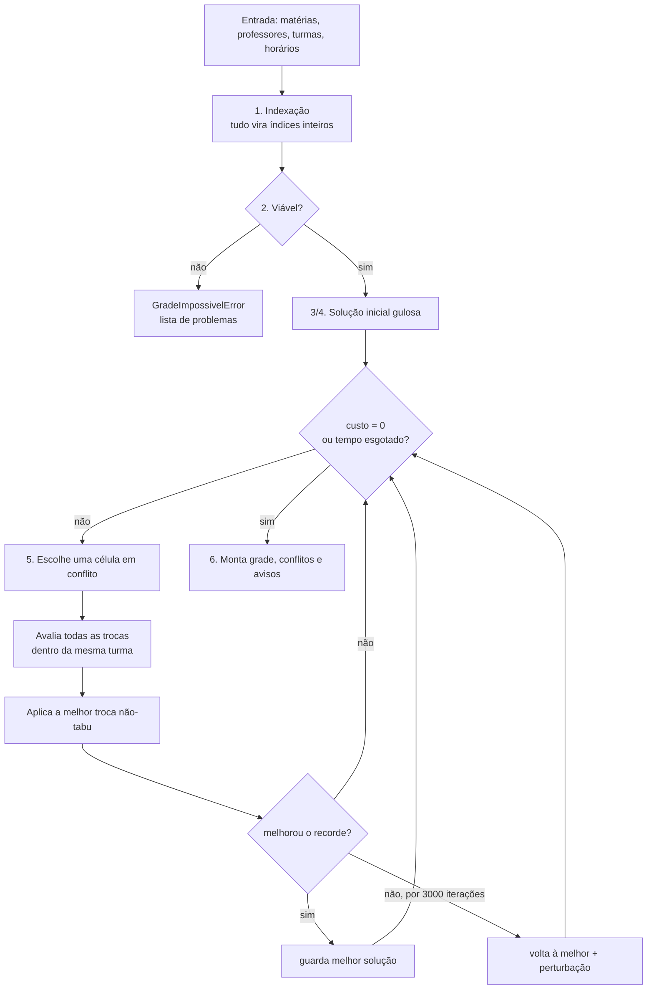

# 🧠 Algoritmo do Gerador de Grade

Como o `backend/src/generator.ts` transforma cadastros em uma grade semanal sem conflitos.

> ⬅️ [Voltar ao README](../README.md)

## Sumário

- [O problema](#o-problema)
- [Restrições](#restrições)
- [Visão geral do algoritmo](#visão-geral-do-algoritmo)
- [1. Indexação](#1-indexação)
- [2. Verificador de viabilidade](#2-verificador-de-viabilidade)
- [3. Representação e função de custo](#3-representação-e-função-de-custo)
- [4. Solução inicial gulosa](#4-solução-inicial-gulosa)
- [5. Busca tabu](#5-busca-tabu)
- [6. Montagem do resultado](#6-montagem-do-resultado)
- [Desempenho](#desempenho)
- [API da função](#api-da-função)
- [Limitações e evoluções](#limitações-e-evoluções)

---

## O problema

Dados:

- **T** turmas, **P** professores e **S = 5 × H** horários na semana (5 dias × H blocos por dia);
- uma lista de **atribuições** "professor *p* dá *n* aulas da matéria *m* na turma *t*";
- os horários **bloqueados** de cada professor;

encontrar, para cada turma, em qual horário acontece cada aula.

É uma variante do clássico *class-teacher timetabling problem*, que é NP-difícil no caso geral (principalmente por causa das indisponibilidades). Por isso usamos uma **meta-heurística** — rápida na prática e sem garantia formal de ótimo — combinada com um **verificador** que detecta os casos claramente impossíveis.

---

## Restrições

| Tipo | Restrição | Peso |
|---|---|---|
| 🔴 **Rígida** | Uma turma não tem duas aulas no mesmo horário | garantida pela representação |
| 🔴 **Rígida** | Um professor não está em duas turmas no mesmo horário | 100 por choque |
| 🔴 **Rígida** | Um professor não dá aula em horário bloqueado | 100 por aula |
| 🟡 **Flexível** | Turma com no máximo `maxAulasMesmaMateriaPorDia` (padrão **2**) aulas da mesma matéria no dia | 1 por aula excedente |

O custo total é a soma ponderada. **Custo 0 = grade perfeita.** Como o peso rígido (100) é muito maior que o flexível (1), o algoritmo sempre prioriza eliminar choques.

---

## Visão geral do algoritmo



---

## 1. Indexação

Turmas, professores e pares *(turma, matéria)* são mapeados para índices inteiros, e cada aula individual vira um item:

```ts
aulas[i] = { turma, prof, par, sigla }   // uma entrada por aula semanal
```

Uma atribuição com 5 aulas gera 5 itens. As indisponibilidades viram um vetor booleano `indisp[slot]` por professor.

- Os IDs (não os nomes) são usados como chave, então dois professores homônimos não se misturam.
- Restrições cujo `dia`/`hora` não correspondem a nenhum bloco configurado geram um **aviso** e são ignoradas.

---

## 2. Verificador de viabilidade

Antes de buscar, checa condições necessárias simples:

| Verificação | Mensagem |
|---|---|
| Lista de horários vazia ou com repetidos | *"Informe pelo menos um horário…"* / *"Existem horários repetidos…"* |
| Nenhuma aula cadastrada | *"Nenhuma aula cadastrada…"* |
| Aulas da turma > S | *"A turma 6A tem 32 aulas, mas a semana só tem 30 horários."* |
| Aulas do professor > horários livres dele | *"João precisa dar 24 aulas, mas só tem 20 horários disponíveis."* |

Se alguma falhar, lança `GradeImpossivelError` com **todos** os problemas, e a API responde `422`.

> Passar no verificador não *garante* que exista solução (as condições são necessárias, não suficientes), mas cobre a imensa maioria dos erros de cadastro.

---

## 3. Representação e função de custo

### A matriz

```
            slot 0   slot 1   …   slot S-1
turma 0  [  aula 3 | aula 7 | … |   -1   ]   ← -1 = vago
turma 1  [  aula 12|   -1   | … | aula 9 ]
…
```

Cada linha contém **exatamente** as aulas daquela turma mais vagos (`-1`) até completar S. Como só fazemos **trocas dentro da mesma linha**:

- a turma nunca perde nem ganha aulas;
- a turma nunca tem duas aulas no mesmo horário.

Ou seja, a primeira restrição rígida é garantida *por construção*, e o algoritmo só precisa cuidar dos professores.

### Estruturas incrementais

| Estrutura | Conteúdo |
|---|---|
| `ocupacaoProf[p·S + s]` | quantas aulas o professor *p* tem no slot *s* |
| `parDia[par·5 + d]` | quantas aulas do par *(turma, matéria)* caem no dia *d* |

Custo local de um professor num slot:

```
choques(p, s) = max(0, n − 1) + (bloqueado(p, s) ? n : 0)       onde n = ocupacaoProf[p, s]
```

Uma troca de duas células mexe em no máximo 4 entradas dessas tabelas, então a **variação de custo (delta) é calculada em O(1)** — sem recalcular a grade inteira. É isso que torna a busca tão rápida.

---

## 4. Solução inicial gulosa

1. Calcula a **folga** de cada professor: `horários livres − aulas`.
2. Ordena as aulas da menor para a maior folga (professores mais "apertados" primeiro; empates aleatórios).
3. Coloca cada aula no slot livre da turma com menor custo imediato (professor livre, horário não bloqueado, matéria ainda abaixo do limite no dia), com um pequeno ruído aleatório.

Em escolas comuns essa etapa sozinha já chega muito perto de custo 0.

---

## 5. Busca tabu

A cada iteração:

1. **Escolhe uma célula em conflito** — aleatoriamente entre as que têm conflito rígido; só se não houver nenhuma, entre as que têm conflito flexível.
2. **Avalia todas as trocas** dessa célula com os outros slots da mesma turma (O(S) avaliações em O(1) cada).
3. **Aplica a melhor troca que não seja tabu** (empates sorteados).
   - **Lista tabu**: ao mover a aula *a* do slot *s*, proíbe *a* de voltar para *s* por 7 a 16 iterações. Isso impede o algoritmo de ficar desfazendo e refazendo o mesmo movimento.
   - **Critério de aspiração**: um movimento tabu é permitido se levar a um custo menor que o melhor já visto.
4. **Recorde**: se o custo bater o melhor, copia a solução.
5. **Estagnação**: após 3000 iterações sem novo recorde, volta para a melhor solução, faz `2·T` trocas aleatórias (perturbação) e limpa a lista tabu.

Para quando o custo chega a **0** ou quando estoura o **tempo limite** (padrão 20 s). A cada ~50 ms o laço faz `await setImmediate`, liberando o servidor para outras requisições.

---

## 6. Montagem do resultado

A **melhor** solução encontrada é convertida para:

```ts
grade[nomeTurma][dia][hora] = "SIGLA (Professor)" | "—"
```

E é reauditada do zero para produzir:

- **`conflitos`** — choques de professor e aulas em horário bloqueado que sobraram (mensagens legíveis);
- **`avisos`** — restrições ignoradas e excesso de aulas da mesma matéria no dia;
- **`completa`** — `true` se não há conflitos.

---

## Desempenho

Medições num notebook comum (Node 24):

| Cenário | Tamanho | Resultado | Tempo |
|---|---|---|---|
| Escola real de exemplo (`create_complex_school.ts`) | 8 turmas · 17 prof. · 30 slots · muitas restrições | ✅ sem conflitos | 2–8 ms |
| Sintético | 20 turmas · 30 prof. · 30 slots | ✅ | ~5 ms |
| Sintético | 40 turmas · 50 prof. · 30 slots · 20% bloqueios | ✅ | ~20 ms |
| Carga 100% (cada professor ocupado em todos os slots) | 15 turmas × 15 prof. | ✅ | ~7 ms |

Para comparação, a versão anterior (*simulated annealing* com trocas aleatórias) levava ~14 s na escola de exemplo e **não** encontrava solução sem choques.

Complexidade por iteração: **O(T·S)** para achar as células em conflito + **O(S)** para avaliar as trocas.

---

## API da função

```ts
import { resolverGrade, GradeImpossivelError } from './generator';

const resultado = await resolverGrade(materias, ['7h', '8h', '9h'], {
  tempoLimiteMs: 20000,             // padrão 20000
  maxAulasMesmaMateriaPorDia: 2,    // padrão 2
});

resultado.grade;      // Grade
resultado.completa;   // boolean
resultado.conflitos;  // string[]
resultado.avisos;     // string[]
resultado.tempoMs;    // number
```

Lança `GradeImpossivelError` (com `.problemas: string[]`) quando o verificador detecta inviabilidade.

O formato de `materias` (`MateriaReq[]`) está em [ARQUITETURA.md](ARQUITETURA.md#school-datats). Para obtê-lo do banco, use `carregarMaterias(prisma, schoolId)`.

---

## Limitações e evoluções

| Hoje | Possível evolução |
|---|---|
| 5 dias fixos (Segunda–Sexta) | Dias configuráveis por escola |
| Só bloqueios rígidos | Preferências (peso flexível) por professor |
| Sem noção de aulas geminadas | Restrição/peso para aulas consecutivas da mesma matéria |
| Sem minimização de "janelas" do professor | Termo flexível para buracos no dia do professor |
| Viabilidade só por contagem | Checagem por emparelhamento (fluxo) por slot |

Para adicionar uma nova restrição flexível: crie uma estrutura incremental como `parDia`, inclua o termo em `mover()` (o delta) e em `celulaConflitante()` (para a busca mirar nela), e reporte em *Montagem do resultado*.
