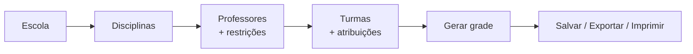

# 📖 Guia de Uso

Este guia mostra, passo a passo, como sair de uma escola vazia até uma grade horária pronta para imprimir.

> ⬅️ [Voltar ao README](../README.md)

## Sumário

1. [Conceitos básicos](#1-conceitos-básicos)
2. [Criando a escola](#2-criando-a-escola)
3. [Disciplinas](#3-disciplinas)
4. [Professores e restrições](#4-professores-e-restrições)
5. [Turmas e atribuição de aulas](#5-turmas-e-atribuição-de-aulas)
6. [Gerando a grade](#6-gerando-a-grade)
7. [Visualizando, exportando e imprimindo](#7-visualizando-exportando-e-imprimindo)
8. [Histórico de grades](#8-histórico-de-grades)
9. [Importação Mágica com IA](#9-importação-mágica-com-ia)
10. [Dicas para grades difíceis](#10-dicas-para-grades-difíceis)
11. [Problemas comuns](#11-problemas-comuns)

---

## 1. Conceitos básicos

| Termo | Significado |
|---|---|
| **Escola** | Agrupa todos os dados. Cada escola é independente. |
| **Disciplina** | Uma matéria, com nome e **sigla** (a sigla aparece na grade). |
| **Professor** | Pessoa que leciona. Pode ter disciplinas vinculadas e **restrições** (horários em que não pode dar aula). |
| **Turma** | Um grupo de alunos (ex.: *6º A*). |
| **Atribuição** | "Professor X dá N aulas semanais de Disciplina Y na Turma Z". É o que o gerador distribui na semana. |
| **Blocos de aula** | Os horários de cada dia (ex.: `7h, 7h50, 8h40`). A semana tem 5 dias × número de blocos. |

O fluxo recomendado é:



---

## 2. Criando a escola

Na tela inicial (**Suas Escolas**), digite o nome e clique em **Criar Escola**. Clique no cartão para abrir o painel da escola.

Cada cartão mostra quantos professores, turmas e disciplinas a escola possui. O ícone de lixeira exclui a escola **e todos os seus dados** (pede confirmação).

---

## 3. Disciplinas

Menu **Disciplinas**:

- Preencha **nome** e **sigla** e clique em **Criar**. A sigla é convertida para maiúsculas automaticamente.
- Clique numa disciplina para:
  - vincular/desvincular professores;
  - ✏️ editar nome e sigla;
  - 🗑️ excluir (remove também as aulas dessa disciplina em todas as turmas).

> 💡 Use siglas curtas e únicas (`MAT`, `PORT`, `EF`). Elas aparecem em cada célula da grade.

---

## 4. Professores e restrições

Menu **Professores**:

1. Digite o nome e clique em **Adicionar**.
2. Clique no cartão do professor para abrir o perfil.

Cada cartão mostra:

- **Matérias** vinculadas;
- **Restrições** cadastradas;
- **Aulas / disponíveis** — total de aulas atribuídas versus horários livres na semana. Se ficar **vermelho**, o professor tem mais aulas do que horários livres e a grade será impossível.

### Aba "Matérias Lecionadas"

Vincule as disciplinas que o professor ensina. Isso filtra as opções na hora de atribuir aulas em uma turma.

> Ao atribuir uma aula a um professor numa turma, a disciplina é vinculada a ele automaticamente.

### Aba "Restrições de Horário"

Uma tabela **dias × horários**:

- clique numa célula para alternar entre 🟩 **Livre** e 🟧 **Bloqueado**;
- clique no **nome do dia** para bloquear/liberar o dia inteiro.

As alterações são salvas na hora.

> ⚠️ Os horários da tabela são os **blocos de aula da última geração** (tela *Gerar Nova Grade*). Se ainda não gerou nenhuma grade, aparece o padrão `7h, 8h, 9h, 10h, 11h`. **Defina os blocos reais primeiro** (gere uma grade, mesmo que incompleta) e depois cadastre as restrições.
>
> Se você mudar os nomes dos blocos depois, as restrições antigas aparecem numa lista separada ("horários que não existem na configuração atual") e são **ignoradas** pelo gerador. Remova-as e marque de novo na tabela.

No topo do perfil, ✏️ renomeia e 🗑️ exclui o professor (junto com as aulas dele).

---

## 5. Turmas e atribuição de aulas

Menu **Turmas**:

1. Digite o nome da turma e clique em **Criar Turma**.
2. Clique na turma para abrir o painel de atribuições.
3. Escolha **Professor**, **Disciplina** e **Quantidade de aulas semanais** e clique em **Atribuir à Turma**.

Dicas:

- Atribuir de novo a mesma combinação professor + disciplina **soma** as aulas em vez de duplicar.
- Clique no número de aulas de uma atribuição para **editá-lo** direto na lista.
- O contador mostra `aulas atribuídas / horários da semana`. Fica vermelho se a turma tiver mais aulas do que cabe na semana.
- Se a turma tiver **menos** aulas que horários, as sobras aparecem como vagas (`—`) na grade.

---

## 6. Gerando a grade

Menu **Gerar Nova Grade**:

1. Em **Blocos de Aula**, informe os horários de cada dia separados por vírgula, por exemplo:
   ```
   7h - 7h45, 7h45 - 8h30, 8h50 - 9h35, 9h35 - 10h20, 10h20 - 11h05, 11h05 - 11h50
   ```
2. Clique em **Gerar Solução** (ou pressione Enter).

O sistema então:

1. **Verifica a viabilidade.** Se for impossível, mostra a lista de motivos, por exemplo:
   - *"A turma 6A tem 32 aulas, mas a semana só tem 30 horários."*
   - *"Mikhail precisa dar 24 aulas, mas só tem 20 horários disponíveis na semana."*
2. **Calcula a grade**, garantindo:
   - nenhum professor em duas turmas ao mesmo tempo;
   - nenhuma aula em horário bloqueado do professor;
   - preferencialmente, no máximo **2 aulas da mesma matéria por dia** em cada turma.
3. **Mostra o resultado** em tela cheia:
   - ✅ **Grade gerada com sucesso** — nenhum conflito;
   - ⚠️ **Grade gerada com conflitos** — lista o que não pôde ser resolvido (raro; veja a [seção 10](#10-dicas-para-grades-difíceis));
   - **Avisos** — preferências não atendidas (ex.: 3 aulas de MAT no mesmo dia) ou restrições com horários inexistentes.

Dê um nome à grade e clique em **Salvar Grade** para guardá-la no histórico. Os blocos de aula usados ficam memorizados para a próxima vez.

> 🔁 Cada geração pode produzir uma grade diferente (há aleatoriedade na busca). Se não gostou, gere de novo.

---

## 7. Visualizando, exportando e imprimindo

Na tela da grade (gerada ou do histórico):

| Botão | O que faz |
|---|---|
| **Por turma** | Uma tabela por turma: célula = sigla + professor. |
| **Por professor** | Uma tabela por professor: célula = turma + sigla. Ótimo para entregar a cada docente. |
| **Exportar CSV** | Baixa um `.csv` (separado por `;`, com acentos corretos) da visão atual. Abre direto no Excel/LibreOffice. |
| **Imprimir** | Abre a impressão do navegador com uma turma (ou professor) por página. Use "Salvar como PDF" para gerar PDF. |

Cada disciplina recebe uma cor fixa para facilitar a leitura.

---

## 8. Histórico de grades

Menu **Histórico de Grades**: lista as grades salvas, da mais recente para a mais antiga.

- 👁️ **Visualizar** — abre a grade com as mesmas opções de visão/exportação/impressão;
- ✏️ **Renomear**;
- 🗑️ **Excluir**.

> As grades salvas são uma "foto" do momento. Alterar professores ou turmas depois **não** altera grades já salvas.

---

## 9. Importação Mágica com IA

Permite cadastrar tudo a partir de uma **foto** (ex.: tabela de atribuições impressa) ou de um **texto livre**.

### Configurar (uma vez)

1. No menu lateral, clique em **Configurações de IA**.
2. Escolha o provedor:
   | Provedor | Texto | Imagem | Onde pegar a chave |
   |---|---|---|---|
   | Google Gemini *(recomendado)* | ✅ | ✅ | [aistudio.google.com](https://aistudio.google.com/) |
   | Anthropic Claude | ✅ | ✅ (JPG, PNG, GIF, WEBP) | [console.anthropic.com](https://console.anthropic.com/) |
   | Cohere | ✅ | ❌ | [dashboard.cohere.com](https://dashboard.cohere.com/) |
3. Cole sua **API Key** e salve.

> 🔒 A chave fica salva apenas no `localStorage` do seu navegador e é enviada ao backend local somente no momento da importação. O custo das chamadas é cobrado pelo provedor na sua conta.

### Importar

1. Vá em **Turmas** e abra o painel **Importação Mágica com IA**.
2. Cole um texto e/ou envie uma imagem. Exemplo de texto:
   ```
   João dá Matemática: 5 aulas no 6A e 5 no 6B. Não pode segunda às 7h nem sexta às 11h05.
   Maria dá Português: 5 aulas no 6A, 4 no 7A. Não pode às terças.
   ```
3. Clique em **Processar Dados**.

Ao final aparece um resumo (ex.: *"2 professores, 2 disciplinas e 3 turmas novos; 4 atribuições"*).

Como a importação se comporta:

- **Não duplica**: disciplinas (pela sigla), professores e turmas (pelo nome, ignorando maiúsculas) já existentes são reaproveitados.
- Se a mesma atribuição já existir, a quantidade de aulas é **atualizada**.
- Restrições novas são **somadas** às existentes, sem repetir.
- É **tudo ou nada**: se algo falhar no meio, nada é gravado.

> ✅ Sempre revise os dados importados. A IA pode errar nomes ou quantidades, principalmente em fotos de baixa qualidade. Para que as restrições funcionem, a IA precisa usar os **mesmos nomes de horário** que você usa no gerador — mencione-os no texto (ex.: *"os horários são 7h, 7h50, 8h40..."*).

---

## 10. Dicas para grades difíceis

Se a grade sair com conflitos ou for considerada impossível:

1. **Leia a lista de problemas** — ela aponta o professor/turma exato.
2. **Confira a carga dos professores** na tela *Professores*: `aulas / disponíveis` em vermelho = impossível.
3. **Professores muito restritos** que dão aula em várias turmas são o gargalo mais comum. Libere alguns horários ou divida aulas com outro professor.
4. **Aulas demais da mesma matéria**: com 6 aulas semanais de uma matéria e 5 dias, uma turma terá obrigatoriamente um dia com 2. Com 11+ aulas, aparecerá aviso de 3 no mesmo dia.
5. **Gere novamente** — a busca tem aleatoriedade.
6. Confira se as restrições usam os **mesmos nomes** dos blocos de aula (veja os avisos).

---

## 11. Problemas comuns

| Sintoma | Causa provável | Solução |
|---|---|---|
| *"Não foi possível conectar ao servidor"* | Backend desligado | Rode `npm run dev` na pasta `backend`. |
| Restrições "ignoradas" nos avisos | Nome do horário diferente dos blocos atuais | Abra o professor, remova as antigas e marque na tabela. |
| Tabela de restrições com horários errados | Ainda não gerou grade com os blocos reais | Gere uma grade com os blocos corretos primeiro. |
| Importação: *"Formato de imagem não suportado"* | Claude não aceita HEIC/BMP etc. | Converta para JPG/PNG ou use o Gemini. |
| Importação: erro de autenticação | Chave errada/expirada ou do provedor errado | Revise em *Configurações de IA*. |
| Importação: *"A IA não retornou um JSON válido"* | Resposta fora do formato | Tente de novo ou envie menos dados por vez. |
| Turma com muitas vagas (`—`) | Poucas aulas atribuídas | Normal: horários sem aula ficam vagos. |
